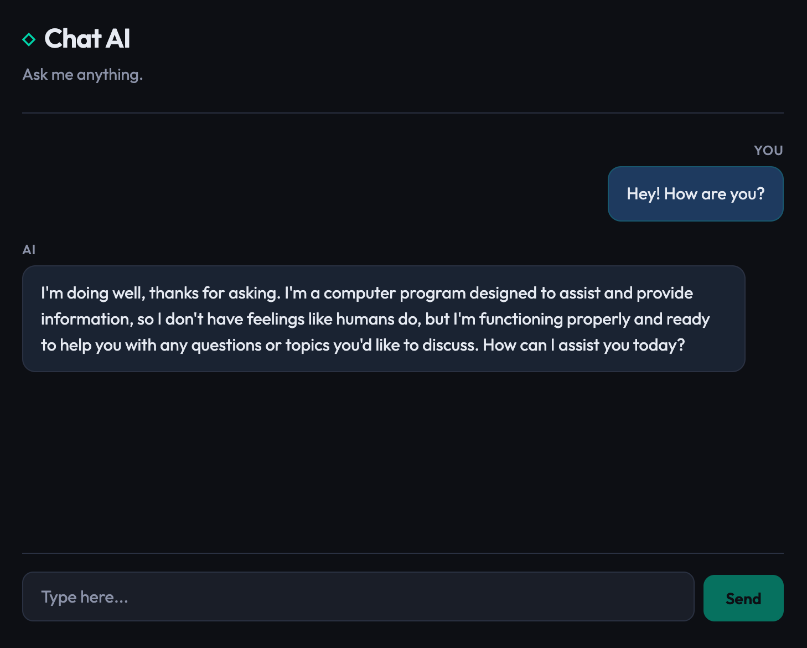

# Chat AI

Full-stack web application with an AI-powered chat using LLMs. The UI is in English; you can use **Groq** (free tier) or **OpenAI** as the provider. Suited as a portfolio project on GitLab or GitHub.


---

## Table of contents

- [Overview](#overview)
- [Features](#features)
- [Tech stack](#tech-stack)
- [Requirements](#requirements)
- [Installation](#installation)
- [Configuration (.env)](#configuration-env)
- [Scripts and commands](#scripts-and-commands)
- [Development](#development)
- [Build and production](#build-and-production)
- [Project structure](#project-structure)
- [Backend API](#backend-api)
- [Pushing to GitLab / GitHub](#pushing-to-gitlab--github)
- [Troubleshooting](#troubleshooting)
- [Company context (optional)](#company-context-optional)
- [Screenshot](#screenshot)
- [Contributing](#contributing)
- [Changelog](#changelog)
- [License](#license)

---

## Overview

Chat AI is a **client–server** application:

- **Frontend:** React (Vite) UI with a dark theme, real-time messages, and loading state.
- **Backend:** Express server that receives messages, calls the provider API (Groq or OpenAI), and returns the reply. API keys are **never** sent to the browser; they stay on the server only.

You can restrict the chat to a **single topic** (e.g. programming, cooking) via an environment variable; if unset, the chat answers on any subject.

---

## Features

- **Real-time chat:** send messages and get AI replies with a typing indicator.
- **Dual provider:** **Groq** (free, Llama model) and **OpenAI** (GPT). If both keys are set, Groq is used.
- **Optional topic limit:** with `CHAT_TOPIC` in `.env`, the chat only answers on that topic and politely redirects off-topic questions.
- **Responsive UI:** works on desktop and mobile, dark theme.
- **Security:** API keys and API calls stay on the server; the frontend only talks to your backend (via proxy in dev).

---

## Screenshot



*Add a screenshot of the chat UI in `docs/screenshot.png` to display it here.*

---

## Tech stack

| Layer    | Technology     | Notes                                           |
| -------- | -------------- | ----------------------------------------------- |
| Frontend | React 18       | UI components, state with `useState`             |
| Build    | Vite 5         | Dev server, proxy to backend, production build  |
| Backend  | Node.js + Express | HTTP server, CORS, JSON body parsing         |
| LLM      | OpenAI SDK     | Works with Groq (custom baseURL) and OpenAI    |
| Styling  | Custom CSS     | CSS variables, no UI framework                  |

---

## Requirements

- **Node.js** 18 or higher ([download](https://nodejs.org/)).
- **One API key** (choose one):
  - **Groq (free):** sign up at [console.groq.com](https://console.groq.com), create a key at [API Keys](https://console.groq.com/keys). Generous free tier.
  - **OpenAI (paid):** get a key at [platform.openai.com/api-keys](https://platform.openai.com/api-keys). New accounts may get initial credit.

---

## Installation

### 1. Clone or download the project

```bash
git clone <repo-url>
cd "Chat AI"
```

### 2. Install dependencies

From the project **root**:

```bash
npm install
cd client && npm install && cd ..
```

### 3. Configure environment variables

```bash
cp .env.example .env
```

Open `.env` and set at least **one** API key (see [Configuration (.env)](#configuration-env)).

### 4. Start the application

```bash
npm run dev
```

Open **http://localhost:5173** in your browser.

---

## Configuration (.env)

The `.env` file lives in the project **root**.

| Variable         | Required   | Description |
| ---------------- | ---------- | ----------- |
| `GROQ_API_KEY`   | One of two | Groq API key. If set, takes precedence over OpenAI. [console.groq.com/keys](https://console.groq.com/keys). |
| `OPENAI_API_KEY` | One of two | OpenAI API key. Used only when `GROQ_API_KEY` is not set. [platform.openai.com/api-keys](https://platform.openai.com/api-keys). |
| `PORT`           | No         | Express server port. Default: `3001`. |
| `CHAT_TOPIC`     | No         | Restrict chat to one topic. Examples: `programming`, `cooking`. Leave empty for no limit. |
| `COMPANY_KNOWLEDGE_PATH` | No | Path to file with company info. Leave unset to disable. See [Company context (optional)](#company-context-optional). |

**Minimal `.env` (Groq only):**

```env
GROQ_API_KEY=gsk_xxxxxxxxxxxxxxxx
PORT=3001
```

After any change to `.env`, **restart the server**.

---

## Scripts and commands

| Command          | Description |
| ---------------- | ----------- |
| `npm run dev`    | Starts server (3001) and Vite frontend (5173). |
| `npm run server` | Starts only Express. |
| `npm run client` | Starts only Vite frontend. |
| `npm run build`  | Builds frontend for production. Output: `client/dist`. |
| `npm run start`  | Starts only Express (no frontend). |

---

## Development

- **Frontend:** [http://localhost:5173](http://localhost:5173)
- **Backend:** [http://localhost:3001](http://localhost:3001)

Requests to `/api/*` are proxied to the backend via Vite. To check the backend: [http://localhost:3001/health](http://localhost:3001/health).

---

## Build and production

```bash
npm run build
```

Output is in **`client/dist`**. The server can serve these static files (see `server/index.js`). In production set `GROQ_API_KEY` or `OPENAI_API_KEY` (and optionally `PORT`, `CHAT_TOPIC`) in your hosting platform’s environment variables.

---

## Project structure

```
Chat AI/
├── client/                 # Frontend React (Vite)
│   ├── src/
│   │   ├── App.jsx
│   │   ├── App.css
│   │   ├── main.jsx
│   │   └── index.css
│   ├── index.html
│   ├── vite.config.js
│   └── package.json
├── docs/
│   ├── company-context.md
│   ├── README.md
│   └── screenshot.png
├── knowledge/
│   └── company.example.md
├── server/
│   └── index.js
├── .env.example
├── .gitignore
├── package.json
└── README.md
```

---

## Backend API

- **GET /health** — Returns `{ ok, provider, topic, companyContext }`.
- **GET /api/config** — Returns `{ topic }`.
- **POST /api/chat** — Body: `{ messages: [{ role, content }, ...] }`. Returns `{ message }`.

---

## Pushing to GitLab / GitHub

The **`.env`** file is in **`.gitignore`** and must **never** be committed. Anyone who clones the repo should create their own `.env` from `.env.example`.

---

## Troubleshooting

### Chat loads but never gets a response

The server may have failed to start because the port is in use. Stop `npm run dev` (Ctrl+C), then:

```bash
lsof -i :3001
kill -9 <PID>
npm run dev
```

### "GROQ_API_KEY not set" / "OPENAI_API_KEY not set"

Ensure `.env` exists in the project root, contains one of the keys, and restart the server.

### 401 or 429 from the provider

- **401:** Invalid or revoked API key. Create a new key and update `.env`.
- **429:** Rate limit or quota exceeded.

---

## Company context (optional)

You can make the chat use **company-specific information** (e.g. business name, products, FAQ). This is **off by default**.

**To enable:**

1. Copy: `cp knowledge/company.example.md knowledge/company.md`
2. Edit `knowledge/company.md` with your company info.
3. In `.env`, set: `COMPANY_KNOWLEDGE_PATH=knowledge/company.md`
4. Restart the server.

The file `knowledge/company.md` is in `.gitignore`. Full instructions: [docs/company-context.md](docs/company-context.md).

---

## Contributing

Contributions are welcome. Fork the repo, make your changes, and open a pull request. Keep the README and code comments in English.

---

## Changelog

### 1.0.0

- Initial release: React + Vite frontend, Express backend.
- Support for Groq (free) and OpenAI.
- Optional `CHAT_TOPIC` and `COMPANY_KNOWLEDGE_PATH`.
- Dark theme, responsive layout, typing indicator.

---

## License

MIT
